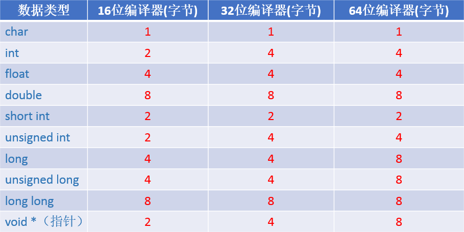
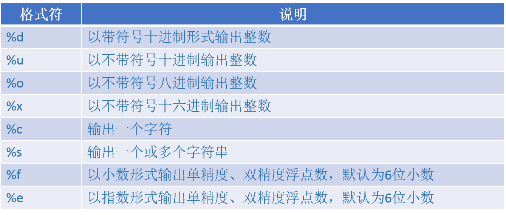

###C语言学习笔记(-)###
__一、参考资源__

* [中文版：Linux C/C++编程一站式学习](http://songjinshan.com/akabook/zh/index.html)
* [GDB中应该知道的几个调试方法](http://coolshell.cn/articles/3643.html)
* [如何学好C语言](http://coolshell.cn/articles/4102.html)
* [C语言结构体里的成员数组和指针](http://coolshell.cn/articles/11377.html)
* [无插件Vim编程技巧](http://coolshell.cn/articles/11312.html)

__二、常用数据类型占用的存储空间__

* 注意：char类型是最小的数据类型单位，在任何类型的编译器下都是占用1个字节，char类型的变量赋值可以直接赋值等于某个字符也可以赋值为整数（对应的ASCII值）。

__三、printf()函数  输出格式符__

